# Athereum: Ethereum-on-AVA

The AVA Network can lend its consensus network to any number of decentralized platforms. To demonstrate this, we have created an early-stage deployment of the Ethereum network. We have deployed a very small 25-node AVA network, where we have deployed Athereum as a subnetwork. 

There is an open RPC connection available with all ETH JSON-RPC calls available. This guide shows you how to access this demo RPC and interact with a demo contract we have deployed to confirm operation. The demo contract is a simple lottery, where you register ("buy" a ticket) with your pubkey, and at the end the winner is selected "randomly" (i.e., we just manually pick one at random). Yes, kinda janky, but it's just here to demonstrate a point. 

If you want to view the contract itself, go [here](https://gist.github.com/StephenButtolph/732f30185fd97b026b53837c8f8042b1#file-registry-sol). *This contract is meant to be simple, not secure, so funds are not #SAFU. Or real, for that matter. Again, this is just a test :)* 

# Requirements

We will be interacting with the contract using MyEtherWallet. You will need a private key to interact with the demo contract. We suggest using a randomly generated private key. You can obtain such a key from [https://vanity-eth.tk/](https://vanity-eth.tk/) by clicking the `Generate` button at the bottom of the page. After that, click `Private key: Click to reveal` and store your private key for later. **You should not use your own private key or Ethereum Keyfile for security reasons.**

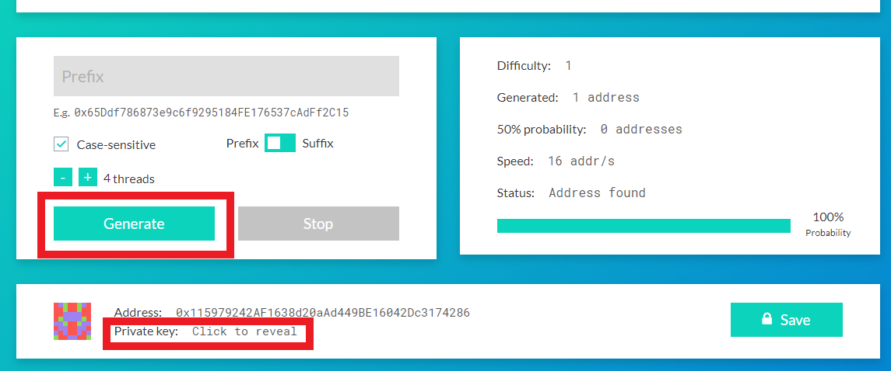

# Creating Your MEW Wallet

To start, go to [https://www.myetherwallet.com/](https://www.myetherwallet.com/)

- [ ]  Visit [https://www.myetherwallet.com/](https://www.myetherwallet.com/)
- [ ]  Click the button that says "`Onwards!`"

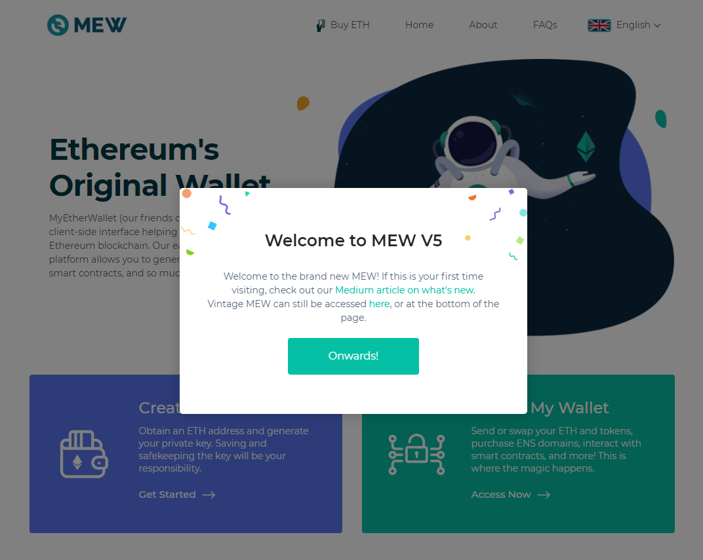

- [ ]  Select the box that says, "`Access My Wallet`"

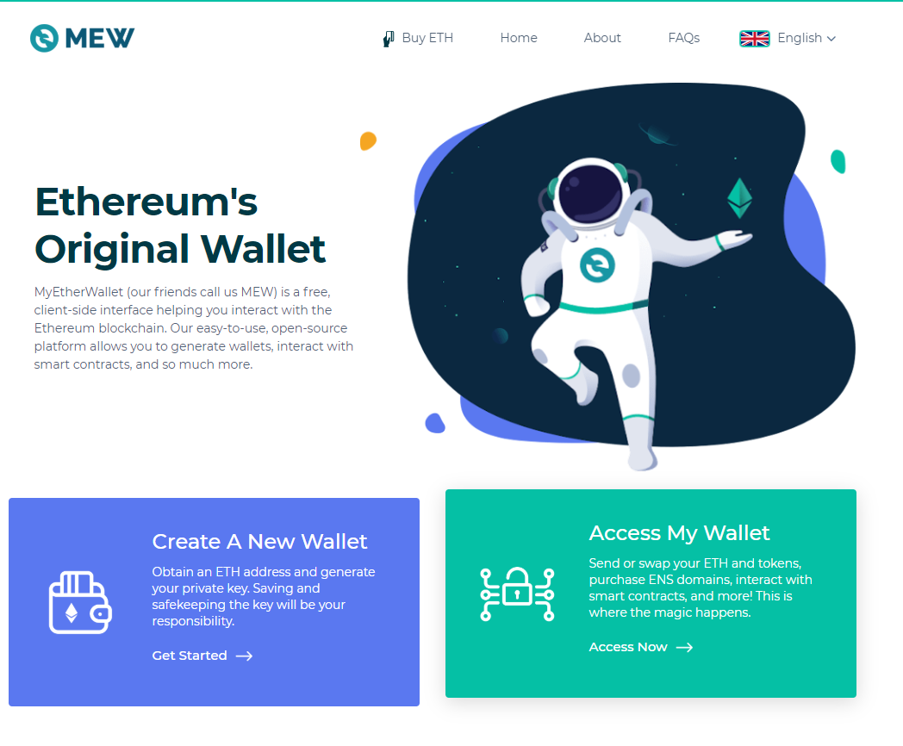

- [ ]  Four options will appear, select the "`Software`" option.

- [ ]  In the following window, you can choose either a Keystore File, Mnemonic Phrase, or Private Key. For this demonstration, use the Private Key generated in the **Requirements** section of these instructions. Select the "`Private Key`" option and hit the "`Continue`" button.

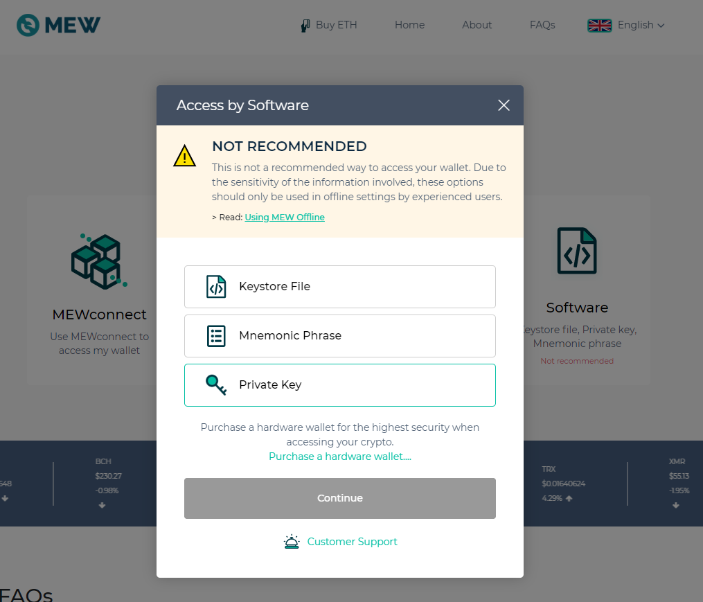

- [ ]  Paste your **newly generated** private key into the input box and press "`Access Wallet`".

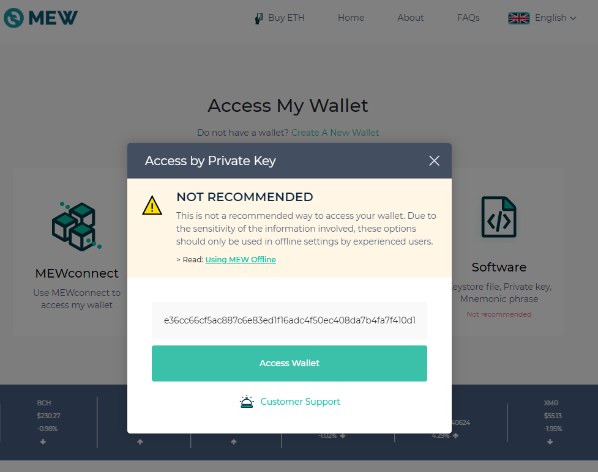

- [ ]  You should now have a MEW Wallet! You will see your address, your balance, and your network. The next section describes how to connect to our Athereum demo network.

# Connecting to Athereum

Using the MEW Wallet you created in the **Creating Your MEW Wallet** section, do the following steps to connect to Athereum.

- [ ]  In the Light-Blue box on the far-right labeled "`Network`", click the "`Change`" button.

- [ ]  In the following screen, toggle the "`Add Custom Network/Node`" button.

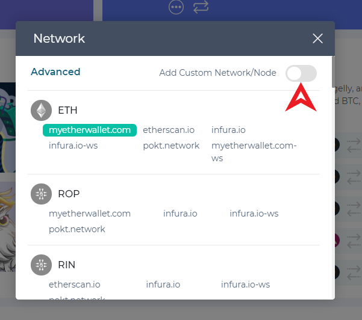

- [ ]  An "`Advanced`" window will come up asking for the information about the custom network.  It should appear as follows.

- [ ]  The default option is the Ethereum Mainnet. Switch that to the "`CUS - CUSTOM`" option at the very bottom of the drop down pictured below.

    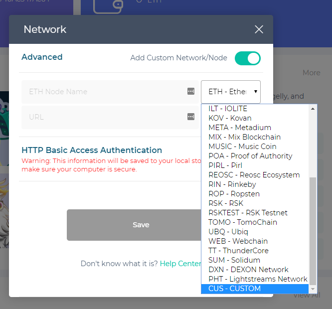

- [ ]  Fill in the fields as in the following picture, with `Port 21015`, `ChainID 43110`, `URL https://ava.network/ext/evm/rpc`, `ExplorerTx http://athexplorer.ava.network/tx/[[txHash]]`, and `ExplorerAddress http://athexplorer.ava.network/address/[[address]]`. Then click "`Save`".

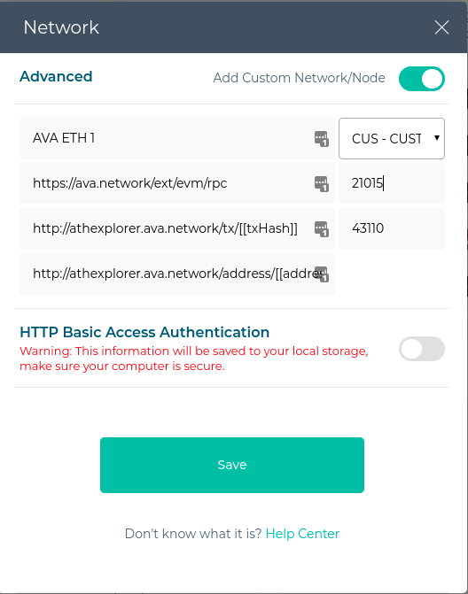

- [ ]  Scroll to the bottom of the Networks window and select "`AVA ETH 1 (CUS)`" under the "`Custom Networks`" heading by clicking on its name.

- [ ]  You should see the following in your wallet's "`Network`" box when complete (your Last Block# will vary).

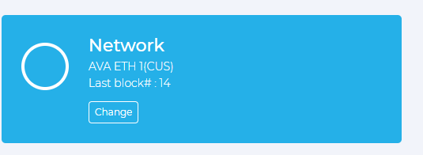

# Interacting With The Contract

We're ready to begin interacting with the smart contract through our Wallet.

- [ ]  In the MEW sidebar on the left of your desktop wallet, expand the "Contract" menu option and click "`Interact with Contract`"

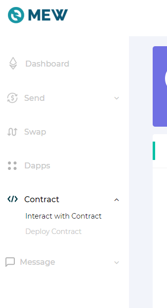

- [ ]  Fill out the "`Contract Address`" field to read "0x1a392d4cA5E4f874D55619F245c3Fc56548C1824" and the "`ABI/JSON Interface`" to have the following value (the contract address in the picture may vary from the contract address above):

[https://gist.github.com/collincusce/d0fe8cea9223bf3ab67a1914173a1e34](https://gist.github.com/collincusce/d0fe8cea9223bf3ab67a1914173a1e34)

- [ ]  Press "`Continue`" to interact with the contract.

    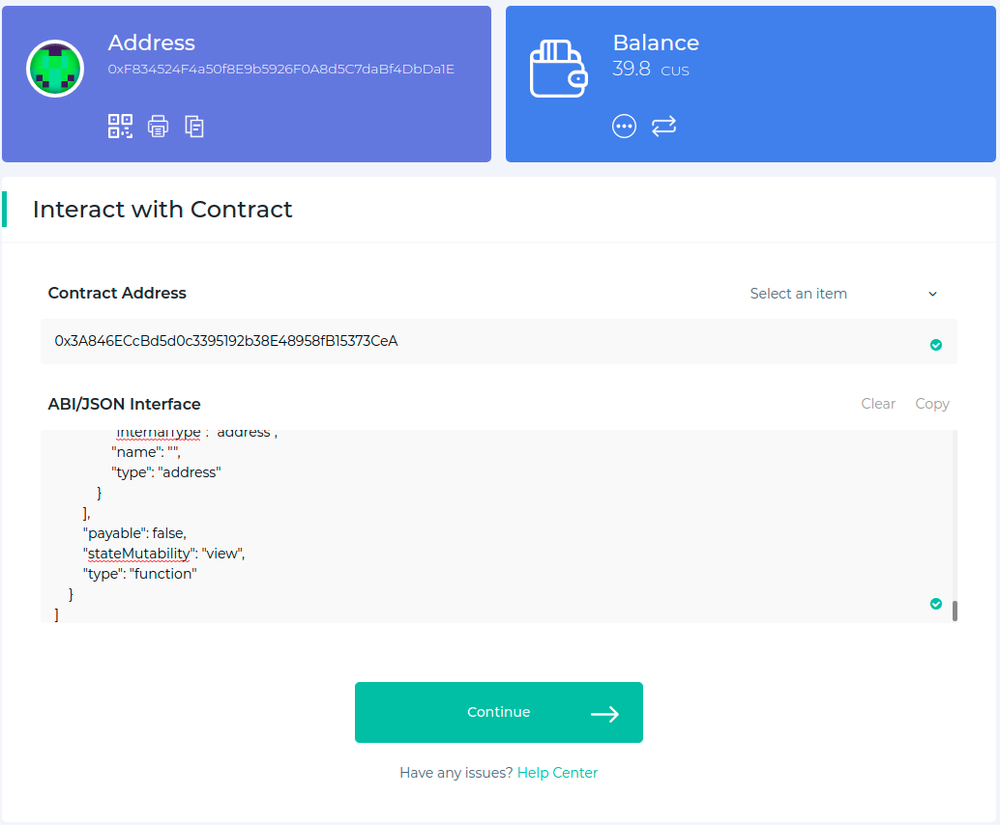

    - [ ]  Select the "`getSize`" function from the drop down on the right.

    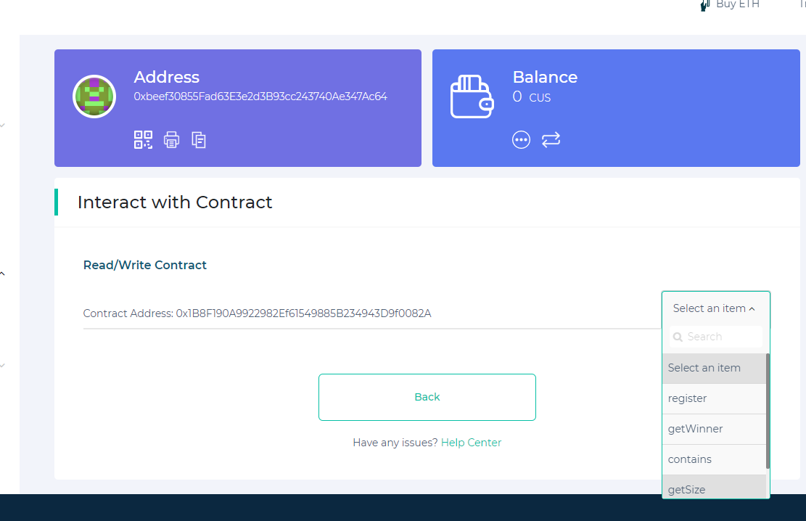

    - [ ]  This calls the "`getSize()`" function in the contract and displays its results. Make note of the "`Result`" value that appears after selecting the function. That number should be strictly increasing as people use the contract.

    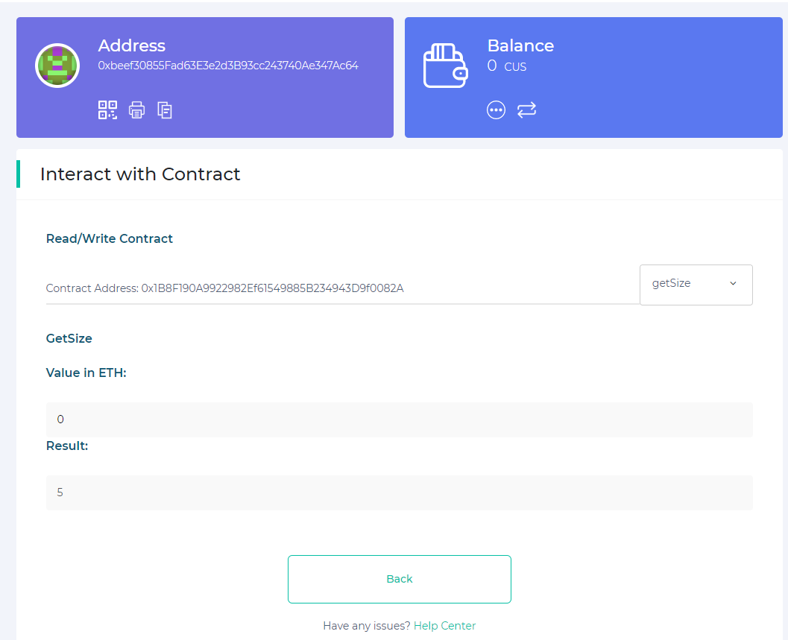

    - [ ]  Now select the "`register`" function from the dropdown on the right.

    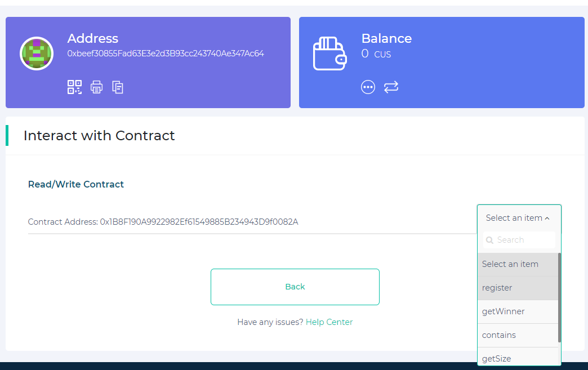

    - [ ]  Leave the fields as-is and press the "`Write`" button to register your address with the contract. *Note: You may only register once per address.*

    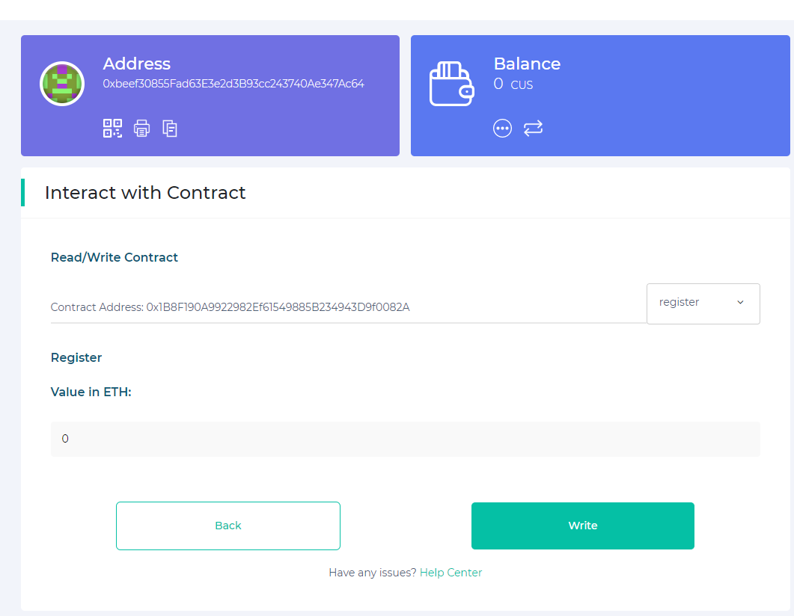

    - [ ]  On the following screens, press the "`Confirm and Send`" button followed by the "Okay" button.

    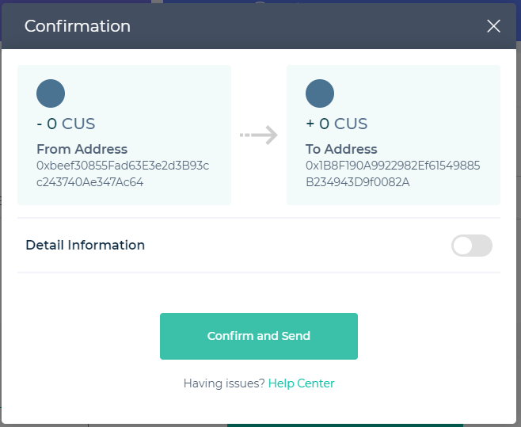

    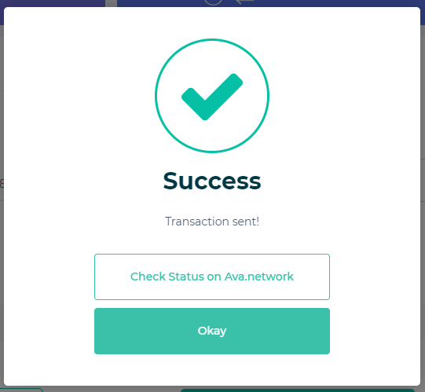

    - [ ]  Select "`getSize`" again, and you should see that the "`Result`" value has increased. If multiple people are using the contract, it should increase by the number of newly registered participants.

    

    # Congratulations!

    You are now able to interact with the Athereum demo network. You can deploy and interact with contracts just as you would using Ethereum mainnet. There are some additional caveats: AVA has sub-second finality, so blocks will be produced exceptionally fast. If your system depends on a certain blocktime, it will need to be adjusted for this new-found speed. In addition, AVA does not require confirmations as part of its protocol. If your system waits for confirmations, it no longer needs to, as this version of Ethereum does not use Longest-Chain Consensus. Lastly, this is a test network using the AVA Alpha Client, not yet publicly released. Connecting unmodified `geth` nodes will not produce the expected behavior. There is no warranty of availability. This system has yet to undergo full hardening. If you see something, say something by sending an email to contact@avalabs.org.

    Enjoy! 

    - AVA Team <3
